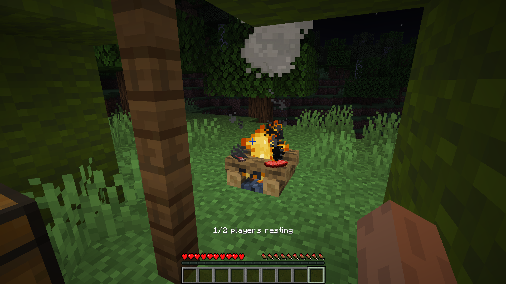

# Chronopyre

This mod adds the ability to rest at campfires to pass the night instead of sleeping in beds.

When it is night or thunderstorming, players may right click a lit campfire with an empty hand to begin resting at it. When enough players are resting, determined by the usual `playersSleepingPercentage` game rule, the advancement of time will speed up, turning a night that normally takes 10 minutes into one that takes 2. When all players using a campfire to rest have finished resting, the campfire will go out. To continue resting, players must stay near their campfire, or else their rest will be cancelled. Additionally, right clicking the campfire you are resting at with an empty hand will cancel your rest.

Campfires have been made unlit by default in order to better balance resting. Beds have also been changed so that players cannot sleep in them. Don't worry though, resting at a campfire will stave off phantoms. However, it is currently impossible for cats to give their owner gifts when resting.

Tent structures have also been added to the world generation, complete with a campfire and meager loot.